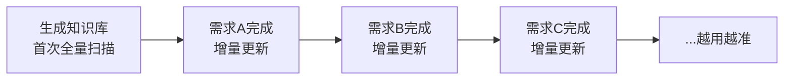
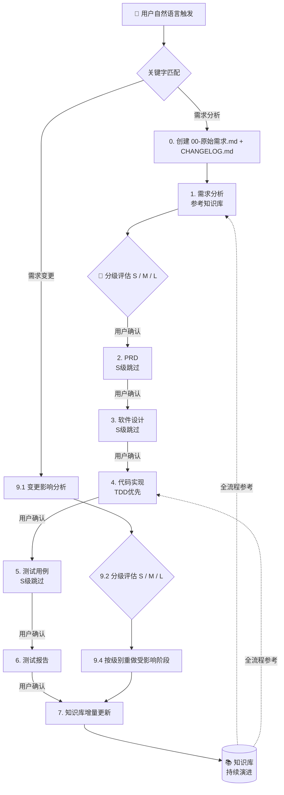
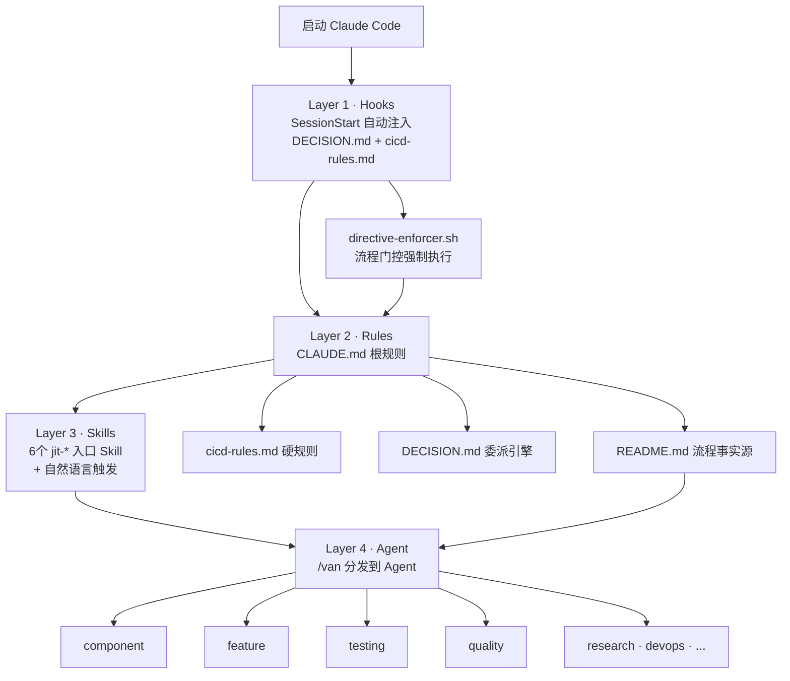
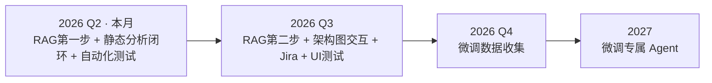
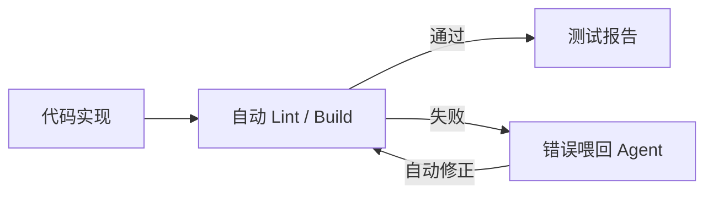
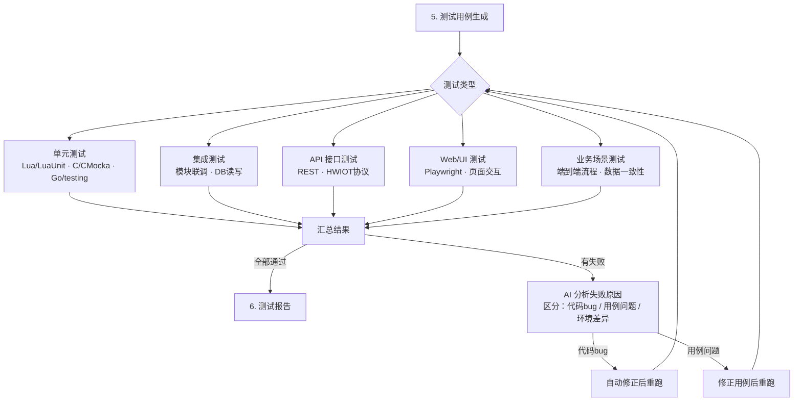
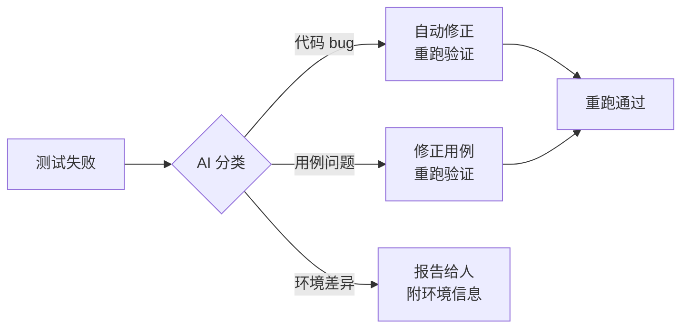
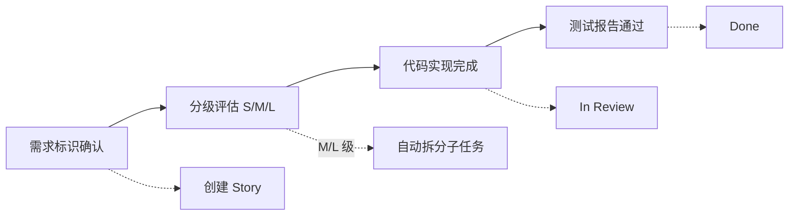

# DevPilot（AI 研发领航）— 产品介绍

> **品牌名**：DevPilot ｜ **中文名**：AI 研发领航 ｜ **简称**：智航
>
> 两条腿走路：**知识库**让项目可被 AI 理解 → **工作流水线**让研发流程自动化 → 知识库持续演进。

---

## 一、为什么需要 DevPilot？

一个需求从提出到上线，你以为只是"写代码"，实际上：

```
需求理解 → 分析文档 → PRD → 设计 → 编码 → 测试 → 报告 → 更新文档
```

每个阶段都在**切换上下文、重复劳动、遗漏边界条件**。更麻烦的是：

- 📄 **文档和代码永远不同步**：代码改了，文档没改；3 个月后没人记得当时为什么这么设计
- 🔍 **新人接手成本高**：面对几十万行代码，不知道从哪看起，不知道改了 A 会不会炸 B
- 🔄 **需求变了要重来**：客户说加个东西，不知道会影响哪些模块，评估靠"经验"

**DevPilot 把"靠人记、靠人传、靠人写"变成"AI 自动执行 + 人做决策"。**

---

## 二、核心一：知识库（项目的 AI 大脑）

### 2.1 为什么知识库是根基

新人接手一个项目，第一件事是什么？**读代码、看文档、理解架构** — 这个过程通常要 1-2 周。

DevPilot 的做法：你只需说一句 **`生成知识库`**，AI 自动扫描整个项目，一次性生成：

| 产出 | 说明 |
|------|------|
| **架构总览** | 项目类型、技术栈、模块划分、目录结构 |
| **模块字典** | 每个模块做什么、依赖谁、被谁依赖 |
| **流程图**（PUML） | 主业务流程、模块调用链、协议路由、安全链路 |
| **编码规范** | 从代码中自动归纳的命名、模式、惯用法 |
| **构建部署说明** | 编译脚本、打包流程、依赖关系 |

**一次生成，全流程复用。** 后续所有需求分析、代码实现、测试都会自动参考知识库。

### 2.2 知识库持续演进

每次需求完成后，**自动增量更新**知识库 — 只更新本次变更涉及的章节，不全量重扫。



> **这是 DevPilot 最核心的价值**：项目知识不是存在人脑子里然后随着离职丢失，而是沉淀在知识库里，持续演进。

---

## 三、核心二：工作流水线（自动化研发流程）

知识库让 AI 理解了项目，接下来**用流水线驱动研发工作**。

### 3.1 流水线全景



### 3.2 自动变更分级

不是所有需求都要走全套流程。AI 自动评估规模，按级别适配：

| 级别 | 文件数 | 流程 |
|:---:|:---:|------|
| **S** | ≤3 | 简要分析 → 直接改 → 简要报告（跳 PRD/设计/测试用例） |
| **M** | 4-15 | 完整 7 阶段：分析→PRD→设计→TDD编码→测试用例→测试报告 |
| **L** | >15 | 策略文档 → 分批执行 → 回归清单 |

> 级别只能升级不能降级。后续发现影响范围扩大时，提示确认升级。

### 3.3 门控确认

每个阶段完成后**必须等用户确认**才能继续。AI 做完功课等你审，不是一条路走到黑。

```
AI: 需求分析完成，📊 M 级（约 8 文件，2 模块），确认后继续 PRD？
你: 确认 / 跳过设计直接编码 / 一次性全部生成
```

---

## 四、DevPilot 不是一堆 Skill 的堆叠

团队可能已经在用 Superpowers 等外部技能（brainstorming、TDD、writing-plans 等）。DevPilot 和它们有什么不同？

### 4.1 Superpowers 的能力

Superpowers 是一个**研发工具箱**，提供 14 个独立技能：

| 技能 | 做什么 |
|------|--------|
| `brainstorming` | 需求探讨 → 设计方案 → 写 spec |
| `writing-plans` | 将 spec 拆成 bite-sized 实现计划 |
| `subagent-driven-development` | 每任务分派独立 subagent，两阶段 review |
| `test-driven-development` | 强制 TDD 纪律 |
| `executing-plans` | 并行 session 执行计划 |
| `dispatching-parallel-agents` | 并行分派多个 agent |
| `requesting-code-review` / `receiving-code-review` | 代码审查流程 |
| `systematic-debugging` | 系统化调试 |
| `finishing-a-development-branch` | 分支收尾 |
| ... | ... |

### 4.2 关键区别：工具箱 vs 流水线

| 维度 | Superpowers（工具箱） | DevPilot（流水线） |
|------|----------------------|---------------------|
| **组织方式** | 独立技能，各自为战 | 7 阶段强制序列，不可跳过门控 |
| **项目理解** | 无 — 每次从零开始读代码 | 有知识库 — 全流程共享上下文 |
| **变更尺度** | 无 — 不评估改动规模 | 自动分级 S/M/L，按级适配流程 |
| **文档产出** | `docs/superpowers/specs/` 自由路径 | `docs/{需求标识}/` 标准化 00-07 命名 |
| **可追溯性** | 无 — 不知道需求从哪来 | 00-原始需求.md 逐字保留 + CHANGELOG.md 全程追踪 |
| **流程闭环** | 无 — 做完就完了 | 测试报告 → 知识库增量更新，形成闭环 |
| **规则注入** | 无 — 靠人记住用哪个技能 | SessionStart Hook 自动注入规则，每个会话强制生效 |

### 4.3 两者的关系：不是替代，是分层

```
┌─────────────────────────────────────────┐
│              DevPilot 流水线              │  ← 管流程：什么阶段、什么顺序、什么级别
│  ┌─────────────────────────────────────┐ │
│  │  阶段内部可调用 Superpowers 技能      │ │  ← 管执行：怎么写、怎么测、怎么审查
│  │  例：代码实现 → 调用 TDD 技能         │ │
│  │      软件设计 → 调用 brainstorming    │ │
│  └─────────────────────────────────────┘ │
└─────────────────────────────────────────┘
```

**FLOW GATE 规则明确规定**：Superpowers 只能在流水线阶段**内部**被调用，绝不允许替代或绕过流水线入口。即使 brainstorming 和"需求分析"匹配度 100%，也必须先走 DevPilot 门控。

---

## 五、技术架构：Skill + Agent + Rules + Hooks

DevPilot 不是"自定义了几个 Skill"这么简单，它是一套完整的**四层架构**。

### 5.1 架构全景



### 5.2 各层职责

**Layer 1 — Hooks（会话注入层）**

每次启动 Claude Code 时，`load-behavioral-system.sh` 自动将 `DECISION.md` + `cicd-rules.md` 注入当前会话。这意味着：**任何人、任何会话，只要在框架目录下启动，流水线规则自动生效**。不需要手动加载、不需要记命令。

**Layer 2 — Rules（规则层）**

| 文件 | 优先级 | 作用 |
|------|:---:|------|
| `CLAUDE.md` | 最高 | 流程门控不可绕过、优先级链、触发关键字、分级规则 |
| `cicd-rules.md` | 会话注入 | 输出路径、目标项目自动识别、00-原始需求模板、分级判定表 |
| `DECISION.md` | 会话注入 | 自动委派决策（什么情况走什么 Agent） |
| `README.md` | 事实源 | 完整流程说明、跨文件一致性锚点 |

**优先级链**：`CLAUDE.md > 外部技能 > cicd-rules.md > 其他规则文件`

**Layer 3 — Skills（用户入口层）**

6 个 `jit-*` 前缀 Skill 是用户交互的入口。流水线阶段（需求分析/PRD/设计/编码/测试）**不通过 Skill 触发**，而是通过自然语言关键字匹配 → 走 `/van` → Agent 执行。

**Layer 4 — Agent（执行层）**

流水线阶段的实际执行者是 **Agent（子代理）**。`/van` 命令读取 README.md 确定当前阶段的执行规范，然后从 `agents.md` 中选择合适的专业化 Agent（component/feature/infrastructure/testing/quality/devops/research 等 15+ 个），分派任务。

### 5.3 和竞品的架构对比

| 工具 | 架构模式 | 核心机制 |
|------|---------|---------|
| **Claude Code 原生** | 模型 + 工具 | 无框架，全靠 prompt |
| **Superpowers** | 纯 Skill 插件 | 用户主动调用 Skill，无规则注入 |
| **GitHub Copilot** | IDE 插件 + Cloud Agent | 代码补全 + Issue→PR |
| **Shipwright** | Agent 编排平台 | 多 Agent 协作，全自动 |
| **DevPilot** | **Hooks → Rules → Skills → Agent 四层架构** | 规则注入 + 流水线门控 + 知识库闭环 |

---

## 六、实际案例：hw_swl_app 项目

> hw_swl_app 是基于 OpenResty 的**无线安全通信网关**（20 万行 Lua/C/Shell），用于嵌入式 PCIe 加密网卡。以下所有成果均由 DevPilot 驱动产出。

### 6.1 知识库：一步理解 20 万行代码

面对 46 个 Lua 模块 + 5 个 C 加密库 + 60+ SKF 硬件接口，一句 `生成知识库` 后自动产出：

| 产出 | 内容 |
|------|------|
| `PROJECT_KNOWLEDGE_BASE.md`（~35KB） | 架构总览 + 46 模块字典 + 技术栈 + 部署说明 |
| `PROJECT_KNOWLEDGE_DETAIL.md`（~50KB） | 深度分析 + 完整开发手册 |
| 8 个 PUML 流程图 | 主业务 / 模块依赖 / 协议路由 / 国密安全链 / 硬件交互链 / OTA状态机 / 密钥层次 / 4次握手 |

**自动识别 8 大项目特征**：OpenResty 网关、自定义 HWIOT 协议、国密加密、SKF 硬件交互、OTA 热更新、认证授权等。

> `docs/knowledge-base/PROJECT_KNOWLEDGE_BASE.md`（v6.5，经历 6 次增量更新）

### 6.2 需求一：国际化技术底座（S 级）

**原始需求**："支持国际化技术底座，涉及界面中所有文字及日志中系统记录的文字均支持切换语言包"

**DevPilot 全量扫描后发现**：容器 APP 是纯后端服务，无 UI，真正对外的文本**只有审计日志 error_desc 中的硬编码中文**。精准定位到 4 个文件约 40 处，方案从"做语言包"简化为"error_desc 统一置空，WSM 侧基于 hex error_code 做多语言映射"。

```
结果：3 天完成分析→编码→报告→知识库增量更新
产出：00-原始需求 + 需求分析(22KB) + 测试报告 + CHANGELOG
```

> `docs/i18n-base/`

### 6.3 需求二：随机MAC获取接口参数修改（S 级）

**原始需求**："完善随机MAC获取接口（0xd001/0xd002）的参数定义和实现"

**DevPilot 做了**：梳理 LAEK/LTAK/GPN 密钥体系统一命名→派生链路分析→新增 1 个函数 + 修改 1 个应答构建→8 项测试全部通过（国密/国际双算法分支自动适配）。

```
结果：beacon_exchange.lua 精准改动，Body 22B→54B，8/8 测试通过
产出：00-原始需求 + 需求分析 + 测试报告 + CHANGELOG
```

> `docs/rmac-interface/`

### 6.4 成果总览

```
hw_swl_app/docs/
├── knowledge-base/                    # ← 核心一：知识库（8 文档 + 8 流程图）
│   ├── PROJECT_KNOWLEDGE_BASE.md      #    架构总览 + 模块字典
│   ├── PROJECT_KNOWLEDGE_DETAIL.md    #    深度分析 + 开发手册
│   ├── CRYPTO_GM.md                   #    国密算法详解
│   ├── CRYPTO_INTL.md                 #    国际算法详解
│   ├── BUILD_DEPLOY.md                #    构建部署说明
│   └── *.puml                         #    8 个流程图
│
├── i18n-base/                         # ← 核心二驱动：需求A
│   ├── 00-原始需求.md                  #    逐字保留的原始需求
│   ├── 01-requirements-analysis.md    #    全量扫描 → 精准定位 40 处
│   ├── 05-test-report.md
│   └── CHANGELOG.md
│
└── rmac-interface/                    # ← 核心二驱动：需求B
    ├── 00-原始需求.md
    ├── 01-requirements-analysis.md    #    密钥体系分析 + 派生链路
    ├── 05-test-report.md              #    8/8 通过
    └── CHANGELOG.md
```

---

## 七、怎么用

### 7.1 安装启动

```bash
git clone <仓库地址> claude-code-autopilot
cd claude-code-autopilot
bash install.sh --tools
```

前置：Node.js >= 18 + git + Claude Code CLI。

```bash
cd D:\my-project        # 在你的项目目录下
claude
/jit-devpilot-init      # 首次激活，自动识别当前目录
```

### 7.2 触发方式

**用自然语言说话**，目标项目路径只需指定一次。

| 你想做什么 | 这样说 |
|-----------|--------|
| **建知识库**（第一步） | `生成知识库` |
| 开始新需求 | `需求分析：功能描述` |
| 生成 PRD | `生成PRD` |
| 软件设计 | `软件设计` 或 `变更策略` |
| 写代码 | `代码实现` |
| 测试用例 | `测试用例` 或 `回归验证` |
| 测试报告 | `测试报告` |
| 修改已有需求 | `需求变更：user-login 增加忘记密码` |
| 同步知识库 | `知识库更新` |
| 查看进度 | `/jit-project-autopilot-status` |

### 7.3 典型工作流

```
👤 生成知识库                          # 第一步：让 AI 理解项目
🤖 扫描 46 模块...知识库已生成

👤 需求分析：用户登录模块
🤖 需求标识建议：user-login → 📊 M 级（约 8 文件，2 模块）
👤 确认
🤖 [创建 00-原始需求.md] 需求分析完成，确认后继续 PRD？
👤 生成PRD
🤖 PRD 完成
👤 软件设计
🤖 设计完成
👤 开始编码
🤖 代码+测试完成
👤 测试报告
🤖 12/12 通过 → 知识库已增量更新 ✅
```

---

## 八、团队定制化拓展

DevPilot 不是一个黑盒。团队可以根据自己的技术栈、流程规范、领域特点进行定制。

### 8.1 从哪里入手

| 定制需求 | 改哪里 | 难度 |
|---------|--------|:---:|
| 调整触发关键字 | `CLAUDE.md` 触发规则表 | ⭐ |
| 修改 S/M/L 分级阈值 | `cicd-rules.md` 分级判定表 | ⭐ |
| 自定义文档模板 | `cicd-rules.md` 00-原始需求模板 / CHANGELOG 模板 | ⭐ |
| 添加项目专属 Skill | `skills/` 目录新增 `SKILL.md` | ⭐⭐ |
| 调整 Agent 分派策略 | `.claude-collective/agents.md` | ⭐⭐ |
| 添加自定义 Hook | `.claude/hooks/` 新增脚本 | ⭐⭐⭐ |
| 修改流程阶段顺序 | `CLAUDE.md` + `README.md` + `cicd-rules.md` 三处同步 | ⭐⭐⭐ |
| 扩展知识库扫描策略 | `skills/jit-project-knowledge-base/SKILL.md` | ⭐⭐⭐ |

### 8.2 典型定制场景

**场景一：团队用 Jira 管理需求**

在 `cicd-rules.md` 追加 Jira 关键字触发规则，需求分析时自动关联 Jira Issue ID，PRD 输出到 Jira 描述字段。

**场景二：Go 微服务项目专属 Agent**

在 `agents.md` 新增 `@go-microservice-agent`，注入 Go 编码规范 + gRPC 最佳实践。流水线的代码实现阶段自动选择此 Agent。

**场景三：金融合规团队的强制审查门**

在 `.claude/hooks/` 新增 `compliance-gate.sh`，代码实现完成后强制调用安全扫描 Agent，不通过则阻断进入测试阶段。

**场景四：前端项目 UI 自动审查**

已有 `jit-ui-ux-pro-max` Skill — 编辑 `.vue/.tsx/.jsx` 时自动激活。团队可以修改其设计规范文件，注入自己的设计系统。

### 8.3 核心文件速查

```
claude-code-autopilot/
├── CLAUDE.md                    # 根规则：改触发关键字、流程定义
├── .claude-collective/
│   ├── cicd-rules.md            # 硬规则：改分级阈值、输出模板、路径规则
│   ├── DECISION.md              # 委派引擎：改自动决策逻辑
│   └── agents.md                # Agent 定义：加领域专属 Agent
├── .claude/hooks/               # Hook 脚本：加自定义阶段门控
├── skills/                      # 入口 Skill：加项目专属命令
└── README.md                    # 流程事实源：改流程时必同步
```

---

## 九、未来规划

DevPilot 的演进围绕一个核心命题：**让 AI 从"能写代码"进化为"懂你的项目、接你的系统、对你的质量负责"。**

### 路线图总览



### 9.1 RAG（检索增强生成）：让 AI 不再"胡说八道"

**要解决的问题**：当前 AI 分析需求、做设计时，全靠模型训练数据 + 你喂的上下文。它不知道你的 Confluence 上有过一篇架构决策记录，不知道数据库有张表已经定义了那个字段——于是它"猜"，猜对了是运气，猜错了就是返工。

**方案分两步走**：

**第一步（当前可做）— 内部知识库检索**

DevPilot 的知识库本身就是现成的 RAG 数据源。在需求分析/设计阶段，Agent 先从 `docs/knowledge-base/` 检索相关模块文档，再开始分析——不需要任何外部系统。

```
用户触发"需求分析：xxx"
  → Agent 先检索知识库，提取相关模块的架构说明、依赖关系
  → 基于检索结果做分析，而非凭空推断
  → 引用来源："根据 PROJECT_KNOWLEDGE_BASE.md §2.3，该模块依赖..."
```

**第二步 — 对接外部知识源**

| 数据源 | 对接方式 | 用途 |
|--------|---------|------|
| Confluence / Wiki | REST API + 全文检索 | 检索历史 PRD、架构决策、技术方案 |
| 数据库 Schema | JDBC / `information_schema` | 理解表结构、字段类型、索引 |
| Git 历史 | 本地 git log | 追溯模块的变更历史、hotfix 记录 |
| 代码仓库 | 文件系统 | 读取相关源码做上下文增强 |

> 目标：需求分析阶段，AI 自动检索"有没有类似需求做过？""这个模块上次是谁改的？""数据库里这个字段是什么类型？"，输出引用来源而非"我猜应该是"。

### 9.2 静态分析闭环：让编译器帮你 review 代码

**要解决的问题**：代码实现阶段 AI 写了代码，但没人验证——linter 报错、编译失败、类型不匹配，这些问题用工具秒级能发现，不应用人眼检查。

**方案**：在代码实现和测试报告之间，插入一个**自动验证环**。



| 检查层 | 工具 | 触发时机 |
|--------|------|---------|
| Lua | `luacheck` | 代码生成后自动跑 |
| C | `gcc -Wall -Werror` | 每次 make 后自动收集 |
| Shell | `shellcheck` | 脚本修改后自动跑 |
| 通用 | SonarQube API | 代码实现完成后自动提交扫描 |
| 格式 | `stylua` / `clang-format` | 代码生成后自动格式化 |

实现方式：`.claude/hooks/` 新增 `post-code-implement.sh`，代码生成后自动触发 lint + build，错误信息结构化后喂回 Agent 自修正。整个闭环在 1-2 分钟内完成。

### 9.3 自动化测试闭环：从"写用例"到"跑通验证"

**要解决的问题**：流水线只产出测试用例文档和测试报告，但**测试本身还是人跑**。单元测试、接口测试、UI 回归应该在 CI 里自动执行，AI 只负责写用例和分析结果。

**方案**：在测试用例和测试报告之间，插入一个**自动执行层**。



| 测试层 | 覆盖范围 | 工具 | 触发时机 |
|--------|---------|------|---------|
| **单元测试** | 函数级：加密算法、协议编解码 | LuaUnit / CMocka / go test | 代码实现完成后自动跑 |
| **集成测试** | 模块级：密钥派生链、升级状态机 | 自定义 test harness + Docker | 单元测试通过后 |
| **API 接口测试** | 协议级：HWIOT 28种消息类型、REST端点 | curl + 断言脚本 / Postman CLI | 集成测试通过后 |
| **Web/UI 测试** | 页面级：管理后台、配置界面 | Playwright / Cypress | 前端代码变更后 |
| **业务场景测试** | 流程级：完整接入→认证→加密→升级 | 自定义场景脚本 + 数据校验 | API 测试通过后 |

实现方式分三步：

**第一步（P0，本月）**：Agent 生成测试用例时，同时输出**可执行格式**（LuaUnit test 文件、curl 脚本），而非纯 Markdown。测试报告阶段自动执行并汇总结果。

```
Agent 生成测试用例
  → human-facing: docs/{需求标识}/04-test-cases.md（给人看）
  → machine-executable: tests/{需求标识}/test_*.lua（给机器跑）
  → machine-executable: tests/{需求标识}/api_*.sh （给机器跑）
```

**第二步（P1，Q3）**：集成 Playwright 做 Web UI 自动化回归——前端项目的 PRD 阶段自动生成页面截图对比基线。

**第三步（P1，Q3）**：AI 区分失败原因——不是所有红字都是 bug，可能是用例写错、环境差异、数据过期。AI 自动分类后，代码 bug 自动修，用例问题交给人确认。



### 9.4 可视化架构图交互：从"看图"到"用图"

**要解决的问题**：当前知识库生成的 PUML 图是静态的——你看到一个模块，想知道它的源码在哪、谁最后改的、关联了什么需求，还得翻别的文档。

**方案**：将架构图从 PUML 升级为可交互的 Mermaid + HTML。

```
点击模块节点 →
  ├── 📂 跳转到源码文件
  ├── 📝 显示该模块的最后 5 次 commit
  ├── 🔗 高亮所有依赖该模块的其他模块
  └── 📋 列出关联的需求标识
```

| 阶段 | 产出 |
|------|------|
| 第一步 | 知识库生成时同时输出 Mermaid 图（利用 `click` 指令绑定文件路径） |
| 第二步 | 注入 git blame 数据，节点悬停显示最后修改者和时间 |
| 第三步 | 模块节点和需求目录双向链接 — 从架构图能跳到需求文档，反之亦然 |

> Mermaid 的 `click` 语法示例：`click MOD_ID href "vscode://file/path/to/module.lua" "打开源码"`

### 9.5 Jira 双向集成：流水线和项目管理不脱节

**要解决的问题**：DevPilot 在本地产出了需求分析、PRD、测试报告，但 PM 在 Jira 上看到的还是"待开发"——两边信息断层。

**方案**：DevPilot 流水线状态 → Jira 自动同步。



| 流水线事件 | Jira 动作 |
|-----------|---------|
| 需求标识确认 | 创建 Story / Task |
| 分级为 M 或 L | 自动创建子任务（需求分析 / 编码 / 测试 等） |
| 需求分析完成 | Story 追加 comment（附分析文档链接） |
| 代码实现完成 | 状态 → In Review |
| 测试报告通过 | 状态 → Done，追加测试摘要 comment |
| 需求变更 | 创建关联 Issue，标注 `blocks` 原需求 |

实现方式：Hook 体系 + Jira REST API。用户在 `cicd-rules.md` 配置 Jira URL / Project Key / API Token 即可启用。

### 9.6 微调专属 Agent：从"懂通用编程"到"懂你的业务"

**要解决的问题**：通用模型面对你的加密卡 API、自定义协议字节序、特定硬件寄存器时，反复在同一个坑里犯错。Prompt Engineering 能补一部分，但根子在于模型没见过你的领域。

**这不是现在要做的事，但要知道什么时候该做。**

```
通用模型 + 知识库 + RAG         ← 当前阶段，覆盖 80% 场景
    ↓ 积累数据
通用模型 + 知识库 + RAG + 微调   ← 当"反复犯错"的案例 > 500 时启动
```

| 阶段 | 动作 | 产出 |
|------|------|------|
| **短期** | 用 RAG + Prompt Engineering 替代微调需求，把领域知识编码到知识库和 Agent system prompt | 零成本，立即见效 |
| **中期** | 收集"AI 反复犯错"的 case：每次代码实现阶段的修正、每次测试报告的失败 → 标记为 `[微调素材]` | 数据集积累 |
| **长期** | 数据集 > 500 高质量样本（需求→正确实现的映射对子）→ 发起微调实验 | 专属模型 |

**判断标准**：不是"项目很复杂就需要微调"，而是"相同类型的错误是否反复出现"。一个复杂的国密算法项目，如果 AI 在知识库+Prompt辅助下已经能正确实现 SM2/SM3/SM4，那就不需要微调。反之，如果 AI 每次都在某个 SKF 接口的调用序列上犯错，那才是微调的信号。

### 9.7 优先级总结

| 优先级 | 方向 | 为什么 | 投入 | 时间窗口 |
|:---:|------|------|:---:|------|
| **P0** | RAG 第一步 + 静态分析闭环 + 自动化测试基础 | 改动最小，收益最直接 | 低 | 本月 |
| **P1** | RAG 第二步 + 架构图交互 + Jira 集成 | 打通外部系统，形成完整工具链 | 中 | Q3 |
| **P2** | 微调数据收集 | 为长期战略打基础，不着急动手 | 低 | Q3-Q4 |
| **P3** | 微调专属 Agent | 需要数据积累，现在不做 | 高 | 2027 |

---

## 十、常见问题

**Q: 知识库每次都要重建吗？**
A: 不用。首次全量扫描，后续 `知识库更新` 只增量更新变更部分（几秒）。

**Q: 必须按顺序走完所有阶段吗？**
A: 不一定。可以说"跳过设计直接编码"。S 级自动跳过 PRD/设计/测试用例。

**Q: 中途需求变了怎么办？**
A: 说 `需求变更：xxx`，AI 自动分析影响范围，只重做受影响的部分。

**Q: 新开会话怎么恢复？**
A: `/jit-project-autopilot-status`，AI 自动扫描已有产出，告诉你进度。

**Q: DevPilot 和 Superpowers 冲突吗？**
A: 不冲突。DevPilot 管流程（什么阶段做什么），Superpowers 管执行（具体怎么做）。DevPilot 阶段内部可以调用 Superpowers 技能。

**Q: 和 Copilot / Cursor 有什么区别？**
A: Copilot/Cursor 是**代码补全**工具，DevPilot 是**研发流程管理**工具 — 它在编码之前帮你做知识库/分析/设计，编码之后帮你做测试/报告/知识库更新。两者互补，不冲突。

---

> 📖 完整规则：[README.md](../README.md) ｜ 快速入门：[快速入门.md](../快速入门.md) ｜ 升级指南：[升级指南.md](../升级指南.md)
